# tariq-ai
🌙 Offline smart assistant for Raspberry Pi | Arabic &amp; English | Quran • Adhan • Stories • No Cloud Required
# GitHub Release Prep — Tariq AI

## 🧠 Overview

Tariq AI is an offline, voice-driven smart assistant for Raspberry Pi. It supports Arabic and English, reacts with animated videos, plays Quran and Adhan, tells jokes and stories, and helps educate children and families with culturally aware content. Designed as a phone-free AI companion.

## 📦 Features

* ✅ Offline voice recognition (Vosk STT)
* ✅ Wake word detection ("Tariq")
* ✅ Multilingual support: Arabic 🇪🇬 & English 🇬🇧
* ✅ Quran mode with video animation
* ✅ Prayer time calculation & Adhan playback
* ✅ Jokes, stories, and hadiths support
* ✅ Mood detection & reaction videos
* ✅ Video-based UI (uses framebuffer)
* ✅ TTS engine (offline & clear)
* ✅ Fully local and secure

## 🖥️ Hardware Requirements

* Raspberry Pi 4/5
* 3.5" Touch LCD (or HDMI)
* Microphone & speaker (3.5mm or USB)
* Micro SD card (16GB+ recommended)

## 🚀 Installation

```bash
# 1. Clone the repository
git clone https://github.com/YOUR_USERNAME/tariq-ai.git
cd tariq-ai

# 2. Install requirements
python3 -m venv venv_tariq
source venv_tariq/bin/activate
pip install -r requirements.txt

# 3. Download Vosk models manually (Arabic + English)
# Place them in: /home/pi/vosk-model-small-ar-0.22 and /home/pi/vosk-model-small-en-us-0.15

# 4. Add execution permission to launcher script
chmod +x assets/launcher/run_tariq.sh
```

## 📂 Project Structure

```
tariq-ai/
├── main.py                # Main entry point
├── command_matcher.py    # Command routing engine
├── audio_input.py        # Audio recorder
├── tts_manager.py        # Text-to-speech
├── quran_player.py       # Quran playback
├── prayer_manager.py     # Prayer time handler
├── video_engine.py       # Framebuffer video playback
├── language_switcher.py  # Toggle AR/EN

 assets/
├── images/
│   ├── screenshots/
│   └── ...
├── sounds/
├── video/
├── quran/
├── music/
├── faces/
├── icons/
├── jokes/
├── stories/
├── hadiths/
└── launcher/

```

## 🧑‍💻 How to Use

Run Tariq via:

```bash
./assets/launcher/run_tariq.sh
```

Speak the wake word "طارق" or "Tariq" (depending on current language). Once awake, give voice commands like:

* "كم الساعة؟"
* "Tell me a joke"
* "ابدأ تشغيل القرآن"

Tariq will respond with audio and show matching video.

## 🌍 Language Toggle
## 📸 Screenshots

| Startup & Interface | Voice Commands | Kids & Language |
|---------------------|----------------|-----------------|
| 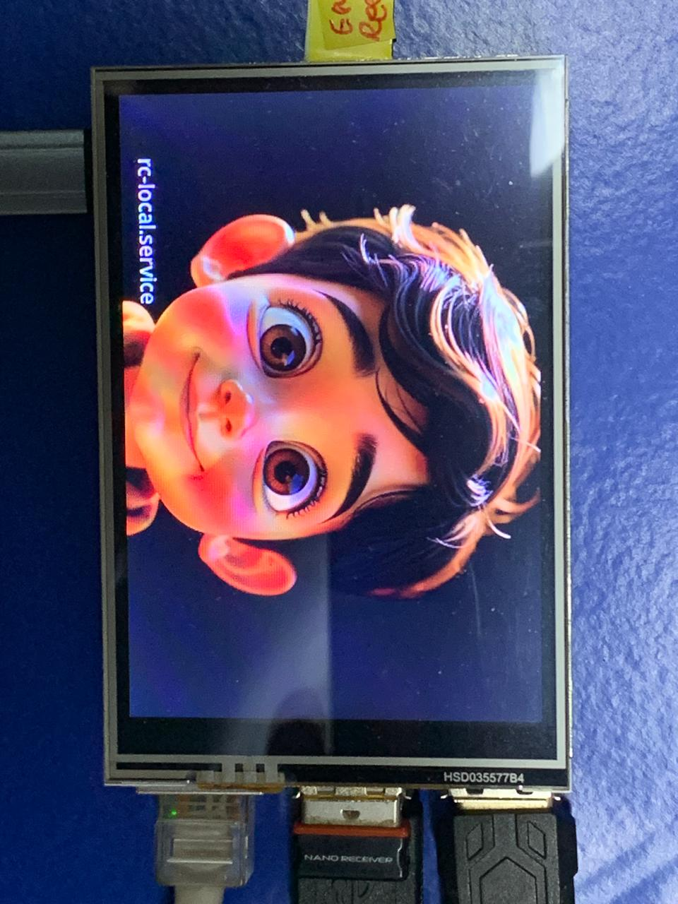 | 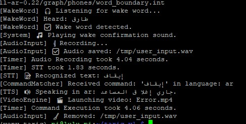 | 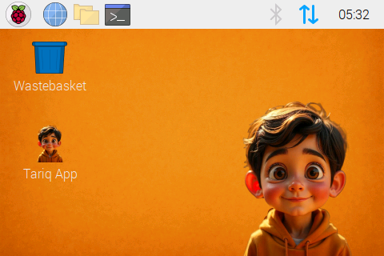 |
| 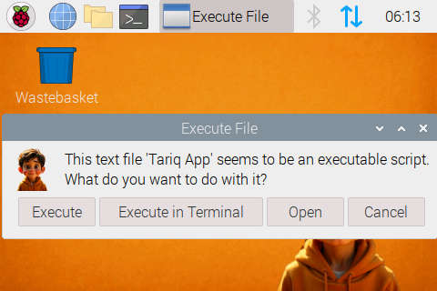 | 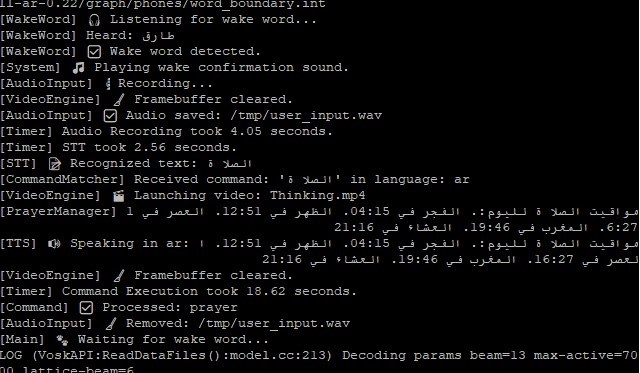 | 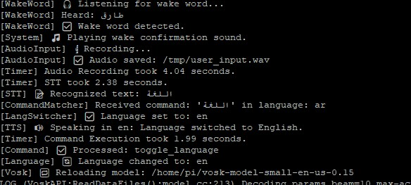 |
| 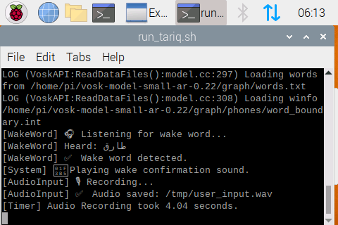 | 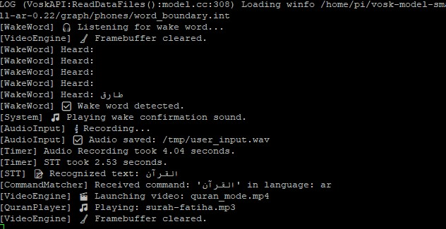 | 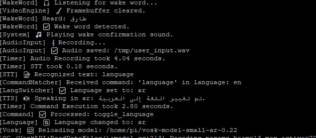 |
| 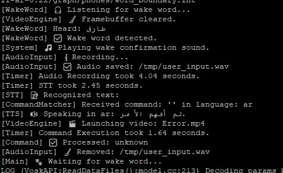 | 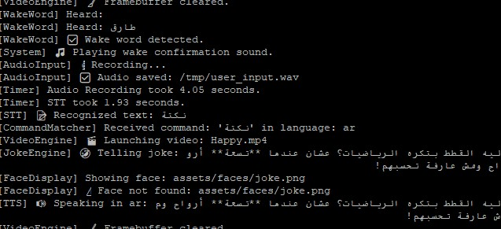 | 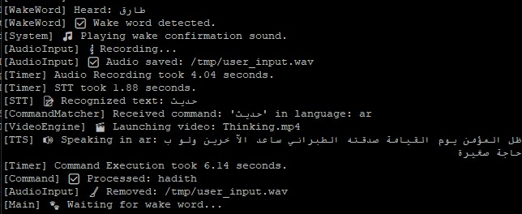 |
| 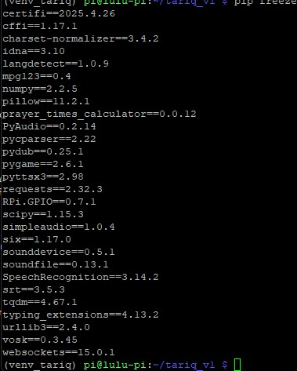 | 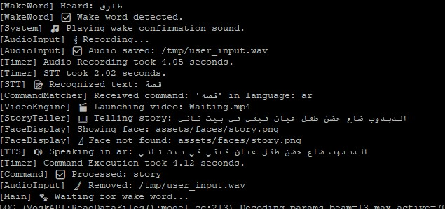 | 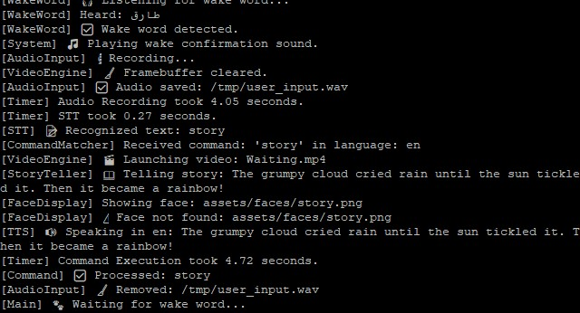 |

> All commands were spoken using the offline STT engine. Reactions are fully local with synchronized video.


Say "language" or "لغة" to switch between Arabic and English.

## ✨ Contributing

We welcome contributions, testing, and localization help!
Please fork the repo and create pull requests.

## ⚖️ License

MIT License — free to use and share with attribution.

---

> This project was developed with love and guidance by ChatGPT + Tariq's creator.
> Join the mission to reshape smart companions for real-world culture and values.
